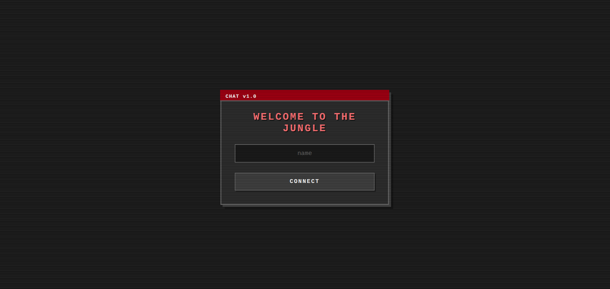
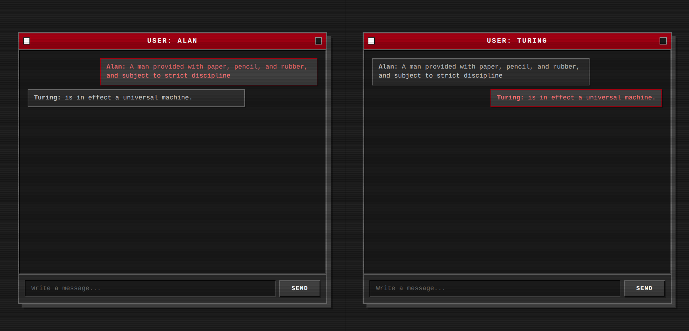

# Axum Retro Chat 🦀 💬

> A high-performance, real-time messaging application built with **Rust** and **WebSockets**, wrapped in a nostalgic 2000s terminal aesthetic.

## 📸 Screenshots

### The Login Terminal
*Minimalist entry point with focus-centered design.*

### The Global Room
*Real-time communication with distinct visual feedback for user messages.*

---

## 🚀 Key Features

* **Real-Time Communication:** Instant messaging powered by WebSockets.
* **High Performance:** Built on Rust's `Axum` framework and `Tokio` runtime for handling massive concurrency with low footprint.
* **Broadcasting System:** Uses `tokio::sync::broadcast` to handle multi-user message distribution efficiently.
* **Retro UI/UX:** Custom CSS implementation inspired by CRT monitors and 2000s interfaces (Monochromatic palette, pixelated fonts).
* **Session Handling:** Lightweight session management using browser storage for seamless navigation between Login and Chat views.

---

## 🛠️ Tech Stack

### Backend (The Powerhouse)
* **Language:** Rust 🦀
* **Framework:** [Axum](https://github.com/tokio-rs/axum) (Ergonomic and modular web framework)
* **Async Runtime:** [Tokio](https://tokio.rs/)
* **Serialization:** Serde & Serde JSON

### Frontend (The Look)
* **Structure:** HTML5 (Semantic)
* **Styling:** CSS3 (Variables, Flexbox, Custom scrollbars) - *No frameworks, pure CSS.*
* **Logic:** Vanilla JavaScript (WebSocket API, DOM Manipulation).

---

## 🧠 Architecture Overview

The application follows a clean separation of concerns:

1.  **Routing:** Axum serves static files (`index.html`, `chat.html`, `style.css`) via specific handlers, mimicking a Multi-Page Application (MPA) feel.
2.  **State Management:** A shared `AppState` struct holds the `broadcast::Sender`, allowing the state to be injected safely across threads using `Arc` (Atomic Reference Counting) internally handled by Axum.
3.  **WebSocket Loop:** Each connection spawns a lightweight Tokio task that splits the socket into a `Sender` and `Receiver`:
    * **Receiver:** Listens for incoming JSON from the client and broadcasts it to the channel.
    * **Sender:** Subscribes to the global channel and pushes messages down to the client.

---

## 🗺️ Roadmap

- [x] Basic Websocket implementation
- [x] Custom Retro Styling
- [x] User names & Session storage
- [ ] Message history persistence (Database integration)
- [ ] User authentication (Login/Password)
- [ ] Private rooms

---

*Created by [Tu Nombre]*