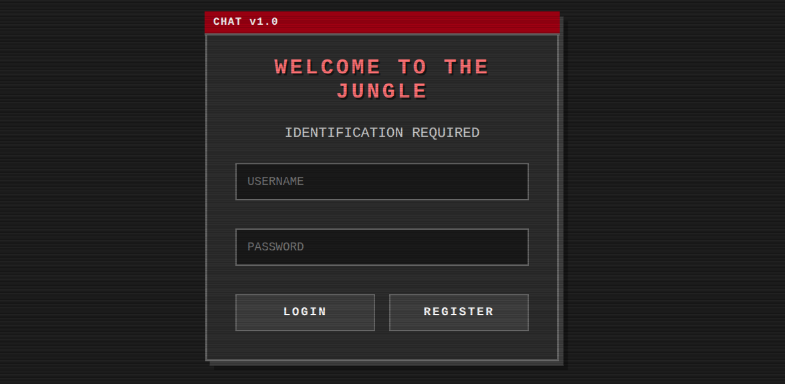
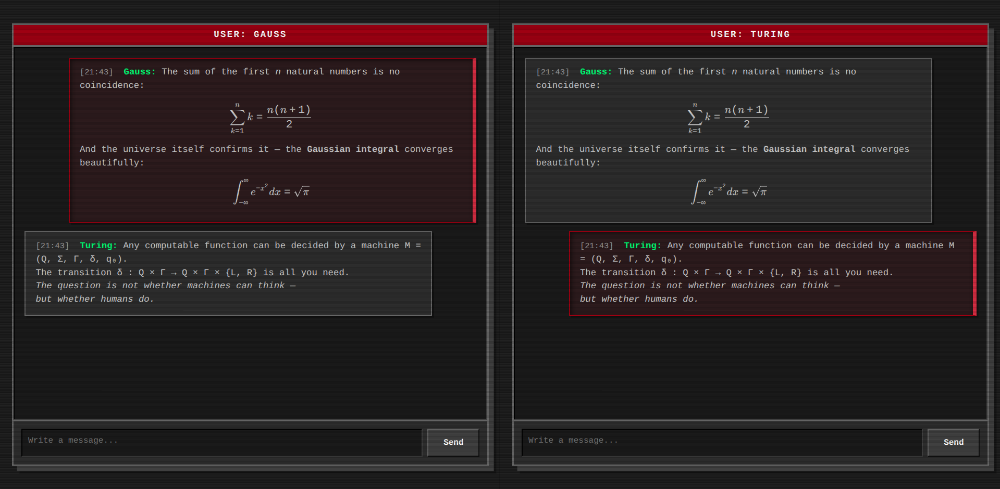

# Rust Retro Chat 🦀 💬

A high-performance, real-time messaging Web-Chat built with Rust and WebSockets.

---

## 📸 Preview

### The Login Terminal  
*Minimalist entry point with focus-centered design.*


### The Global Room
*Real-time communication with distinct visual feedback for user messages.*



---

## 🚀 Key Features

- **Real-Time Communication:** Instant messaging powered by WebSockets.
- **Persistent History:** Database integration using SQLite with `SQLx` for asynchronous queries.
- **Rich Content Rendering:**
  - **Markdown Support:** Full GFM (GitHub Flavored Markdown) support via `Marked.js`.
  - **Syntax Highlighting:** Real-time code highlighting for multiple languages (C++, Rust, JS) using `Highlight.js`.
  - **Scientific Math:** LaTeX rendering for complex equations via `KaTeX`.
- **Visual Identity:** Dynamic, session-persistent user colors (WhatsApp-style) to distinguish participants in the terminal.
- **High Performance:** Modular architecture built on `Axum` and `Tokio` for low-latency broadcasting.
- **Retro UI/UX:** CRT scanlines, monochromatic palettes, and pixel-perfect terminal design.

---

## 🛠️ Tech Stack

### Backend (The Powerhouse)

| Component | Technology |
|---|---|
| Language | Rust 🦀 |
| Framework | Axum |
| Database | SQLite + SQLx (Asynchronous SQL) |
| Async Runtime | Tokio |
| Serialization | Serde & Serde JSON |

### Frontend (The Look)

| Component | Technology |
|---|---|
| Logic | Vanilla JavaScript + WebSocket API |
| Markdown/Math | Marked.js, Highlight.js & KaTeX |
| Styling | Pure CSS3 (Variables, Flexbox, Custom scrollbars) |

---

## 📦 Project Structure (Modular)

El proyecto ha evolucionado hacia una estructura modular para facilitar la escalabilidad:

```
src/
├── main.rs      # Entry point: Server config, DB init & Routing.
├── state.rs     # Shared AppState (Broadcast channel & DB Pool).
└── handlers.rs  # Business logic: Static file serving & WebSocket loop.
```

---

## 🧠 Architecture Highlights

1. **Database Persistence:** Los mensajes se guardan en tiempo real en una base de datos SQLite. Al conectarse, el servidor recupera automáticamente los últimos 100 mensajes del historial.
2. **State Management:** Uso de `tokio::sync::broadcast` para una distribución de mensajes eficiente de uno a muchos (one-to-many).
3. **Client-Side Rendering:** El servidor transmite texto plano de alto rendimiento; la seguridad (XSS protection) y el renderizado complejo (Markdown/LaTeX) se procesan en el cliente.

---

## 🗺️ Roadmap

- [x] Basic Websocket implementation
- [x] Custom Retro Styling
- [x] Message history persistence (SQLite)
- [x] Markdown, Code & LaTeX Support
- [x] User color identity
- [x] Modular codebase
- [ ] User authentication (Login/Password with `bcrypt`)
- [ ] Anti-spam system (Rate Limiting)
- [ ] Online users list

---
 
> ⚠️ **Disclaimer:** This project was developed for learning purposes. Its goal is to explore the Rust ecosystem, WebSockets, and real-time application architectures.
 
---

*Created by itsmateh*